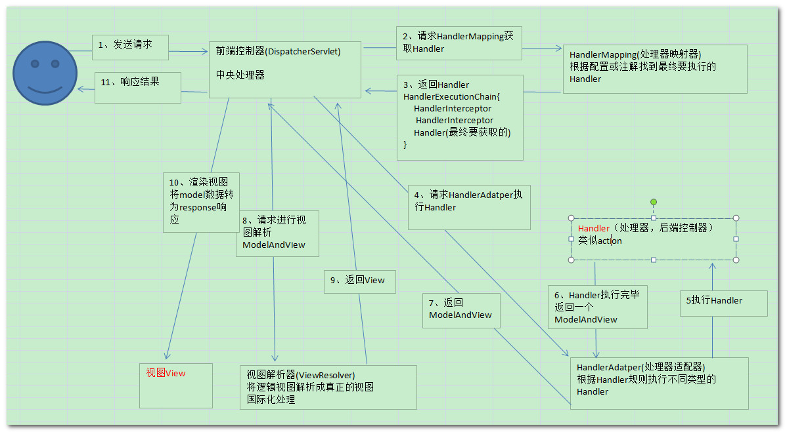
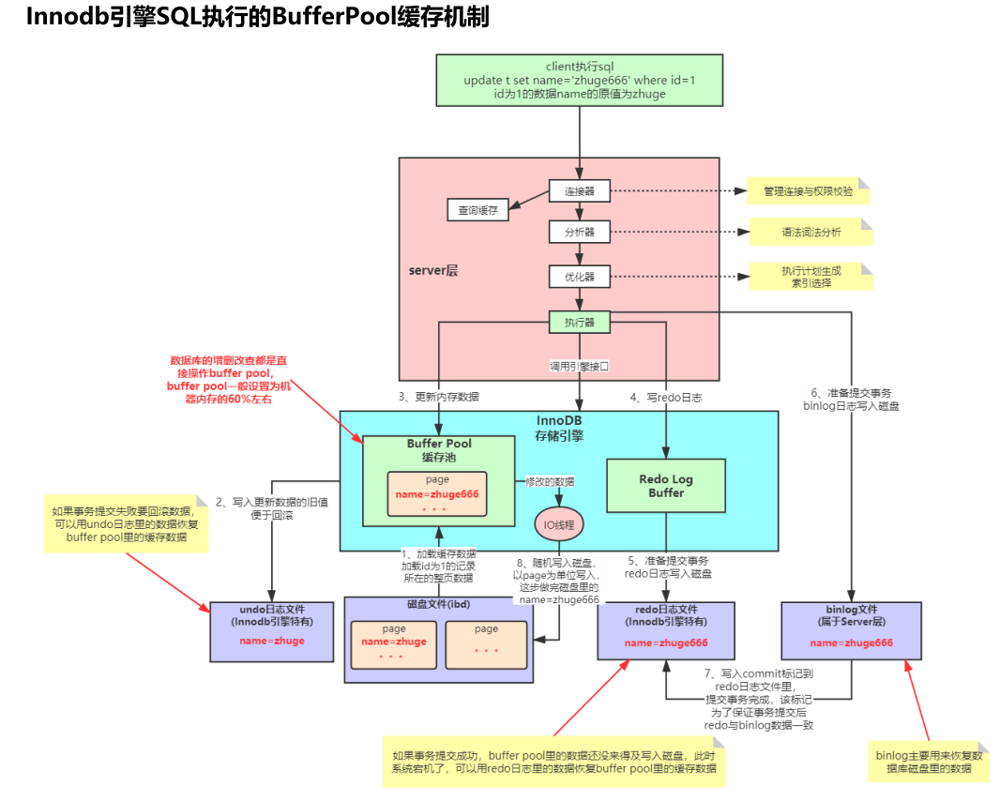

## Question


### 1.java

##### 1.1 说说java对象的在jvm中的创建过程

##### 1.2 java里面两把锁的不同点？lock()里面线程等待的过程是怎样的

##### 1.3 volatile关键字的作用？什么是指令重排？volatile为什么能保证可见性？内存屏障的原理？原子性如何保证？

##### 1.4 什么是双亲委派模型？如何破坏？


### 2. spring

##### 2.1 feign的调用过程

##### 2.2 springMVC的调用过程

##### 2.3 springboot的自动装配过程

##### 2.4 spring的事务？

##### 2.5 事务失效场景及其原因

##### 2.6 常见的分布式事务解决方案


### 3. mysql

##### 3.1 一张表 里面有 id userName phone createTime 4个字段，userName和phone的两个索引不唯一。一个查询包含两个条件索引是如何走的？

##### 3.2 sql语句的执行流程

##### 3.2 mysql里面有哪些锁？具体作用

##### 3.3 索引失效的情况有哪些？

##### 3.4 什么是回表？


### 4. redis

##### 4.1 缓存 击穿、穿透、雪崩如何处理

##### 4.2 如何保证redis和mysql的数据一致性？查的时候的流程，修改的时候的流程？


### 5. kafka

##### 5.1 发生消息丢失如何处理？

##### 5.2 Kafka如何处理大量积压消息

##### 5.3 消费幂等的通用解决方案


### 6. docker


### 7. mongo/es/等等其他常用中间件


## Answer

### 1.java

##### 1.1 说说java对象的在jvm中的创建过程

```shell
类加载会经历：加载、验证、准备、解析和初始化五个阶段。

1. 加载
通过一个类的权限定名来获取定义此类的二进制字节流。（花样很多，加密，网络获取，计算生成，数据库读取）如果找不到会抛出NoClassDefFoundError
将这个字节流所代表的静态存储结构转化为方法区的运行时数据结构
在内存中生成一个代表着个类的java.lang.Class对象，作为方法区这个类的各种数据的访问入口。

2. 验证
文件格式。是否魔数0xCAFEBABE开头，版本号虚拟机是否适配等
元数据。是否符合Java语言规范
字节码。语义是否合法
符号引用。是否缺少或禁止访问需要的外部类、方法等。
（VerifyError、ClassFormatError、UnsupportedClassVersionError）

3. 准备
为类中定义的变量（静态变量）分配内存，设置初始值。

4. 解析
将常量池内的符号引用替换为直接引用。

5. 初始化
执行类构造器()方法。由编译器自动收集类中的所有类变量的赋值动作和静态语句块中的语句合并产生。（注意按顺序收集，静态语句块中语句无法访问定义在语句块之后的变量）
JVM明确规定，必须在类的首次主动使用时才能执行类的初始化
```


##### 1.2 java里面两把锁的不同点？lock()里面线程等待的过程是怎样的

```shell
(1)synchronized和Lock都是可重入锁,前者是jvm中使用monitorenter(1个)和monitorexit(2个)来实现同步且其中阻塞和唤醒是wait和notify,后者是juc包中的lock层次使用,依赖于AQS来实现加锁和解锁;
(2)synchronized是非公平锁,ReentrantLock可以设置公平锁或者非公平锁;
(3)synchronized是不可中断且无法获取锁状态,后者是可中断lockInterruptibly方法,同时也可获取锁的状态isLocked();
(4)synchronized是不能精准唤醒的,ReentrantLock是可以依赖于Condition对象设置条件进行精准唤醒;
(5)synchronized是jdk提供的关键字,Lock是普通的java类(接口),前者可锁方法或代码块,后者只能锁代码块;
(6)synchronized是不会产生死锁,lock使用lock()方法和unlock()方法成对使用,否则产生死锁;
```

[从ReentrantLock的实现看AQS的原理及应用](https://tech.meituan.com/2019/12/05/aqs-theory-and-apply.html)


##### 1.3 volatile关键字的作用？什么是指令重排？volatile为什么能保证可见性？内存屏障的原理？原子性如何保证？

##### [网页链接1](https://www.csdn.net/tags/MtjaAg5sMDM4MDItYmxvZwO0O0OO0O0O.html)   [网页链接2](https://blog.csdn.net/sinat_32873711/article/details/106619965)

```shell
volatile可以保证可见性，一个线程对共享变量值的修改，能够及时同步到主内存，被其他线程看到。
编译器执行指令的时候会存在指令重排的情况，以便于提高指令的执行速度，比如同类型对象的生成。但是存在依赖性的指令不会发生重排。
volatile关键字修饰的共享变量在转换成汇编语言时，会加上内存屏障保证读写可见。
基于JVM层面来说，内存屏障保证在部分语句的读/写操作之前要保证前置的语句完成（这里的前置条件可能是读也可能是写，看具体用的哪种内存屏障）
原子性可以使用CAS保证
```

##### 1.4 什么是双亲委派模型？如何破坏？

```shell
如果一个类加载器收到了加载类的请求，不会先自己尝试加载，而是先委派给父类加载器去加载。启动类加载器->扩展类加载器->应用程序类加载器->自定义类加载器
典型的线程上下文类加载器就破坏了，可以逆向加载类。典型比如JDBC、JNDI
```


### 2. spring

##### 2.1 feign的调用过程

[Feign的原理](https://blog.csdn.net/xjk201/article/details/107645501)

```shell
FeignInvocationHandler 的实现：
第1步：通过Spring IOC 容器实例，装配代理实例，然后进行远程调用。
第2步：执行 InvokeHandler 调用处理器的invoke(…)方法
第3步：执行 MethodHandler 方法处理器的invoke(…)方法
	1）首先通过 SynchronousMethodHandler 内部的client实例，实质为负责客户端负载均衡 LoadBalancerFeignClient 实例，首先查找到远程的 server 服务端；
	2） 然后再由LoadBalancerFeignClient 实例内部包装的feign.Client.Default 内部类实例，去请求server端服务器，完成URL请求处理。
第4步：通过 feign.Client 客户端成员，完成远程 URL 请求执行和获取远程结果
```


##### 2.2 springMVC的调用过程

[SpringMVC的工作原理](https://www.cnblogs.com/fengquan-blog/p/11161084.html)

```shell
1、  用户发送请求至前端控制器DispatcherServlet。
2、  DispatcherServlet收到请求调用HandlerMapping处理器映射器。
3、  处理器映射器找到具体的处理器(可以根据xml配置、注解进行查找)，生成处理器对象及处理器拦截器(如果有则生成)一并返回给DispatcherServlet。
4、  DispatcherServlet调用HandlerAdapter处理器适配器。
5、  HandlerAdapter经过适配调用具体的处理器(Controller，也叫后端控制器)。
6、  Controller执行完成返回ModelAndView。
7、  HandlerAdapter将controller执行结果ModelAndView返回给DispatcherServlet。
8、  DispatcherServlet将ModelAndView传给ViewReslover视图解析器。
9、  ViewReslover解析后返回具体View。
10、 DispatcherServlet根据View进行渲染视图（即将模型数据填充至视图中）。
11、 DispatcherServlet响应用户。
```




##### 2.3 springboot的自动装配过程

```shell
1）通过注解@SpringBootApplication=>@EnableAutoConfiguration=>@Import({AutoConfigurationImportSelector.class})实现自动装配
2）AutoConfigurationImportSelector类中重写了ImportSelector中selectImports方法，批量返回需要装配的配置类
3）通过Spring提供的SpringFactoriesLoader机制，扫描classpath下的META-INF/spring.factories文件，读取需要自动装配的配置类
4）依据条件筛选的方式，把不符合的配置类移除掉，最终完成自动装配
```

[SpringBoot自动装配原理及分析](https://baijiahao.baidu.com/s?id=1725265949551075777&wfr=spider&for=pc)


##### 2.4 spring的事务？

[Spring事务实现原理](https://zhuanlan.zhihu.com/p/228451195)


##### 2.5 事务失效场景及其原因

```shell
1. 数据库存储引擎不支持
2. 未指定RollbackOn，且抛出的异常并非RuntimeException
	DefualtTransactionAttribute#rollbackOn 中有如下代码：
		return (ex instanceof RuntimeException || ex instanceof Error);
3. 同一个类中调用事务方法
	 Spring事务是基于动态代理的，而当在类当中调用事务的方法时，动态代理是无法生效的，因为此时你拿到的this指向的已经是被代理类(Target)，而非代理类(Proxy)。
4. 非公开方法上的事务
	 cglib的局限应该是在 private 或是 final 的方法，而 protected 和 defualt 方法也失效的原因在于AnnotationTransactionAttributeSource中属性publicMethodsOnly的默认值为true
```


##### 2.6 常见的分布式事务解决方案

- 2PC(二阶段提交)方案、3PC

- TCC（Try、Confirm、Cancel）

- 本地消息表

- 最大努力通知

- seata

```shell
2PC(二阶段提交)方案

2PC，即两阶段提交，它将分布式事务的提交拆分为2个阶段：prepare和commit/rollback，即准备阶段和提交执行阶段。在prepare准备阶段需要等待所有参与子事务的反馈，因此可能造成数据库资源锁定时间过长，不适合并发高以及子事务生命周长较长的业务场景。并且协调者宕机的话，所有的参与者都收不到提交或回滚指令。
```

```shell
3PC

两阶段提交分别是：CanCommit，PreCommit 和 doCommit，这里不再详述。3PC 利用超时机制解决了 2PC 的同步阻塞问题，避免资源被永久锁定，进一步加强了整个事务过程的可靠性。但是 3PC 同样无法应对类似的宕机问题，只不过出现多数据源中数据不一致问题的概率更小。
```

```shell
TCC 采用了补偿机制，其核心思想是：针对每个操作，都要注册一个与其对应的确认和补偿（撤销）操作。它分为三个阶段：Try-Confirm-Cancel

try阶段：尝试去执行，完成所有业务的一致性检查，预留必须的业务资源。
Confirm阶段：该阶段对业务进行确认提交，不做任何检查，因为try阶段已经检查过了，默认Confirm阶段是不会出错的。
Cancel 阶段：若业务执行失败，则进入该阶段，它会释放try阶段占用的所有业务资源，并回滚Confirm阶段执行的所有操作。
TCC方案让应用可以自定义数据库操作的粒度，降低了锁冲突，可以提升性能。但是应用侵入性强，try、confirm、cancel三个阶段都需要业务逻辑实现。
```

```shell
本地消息表

ebay最初提出本地消息表这个方案，来解决分布式事务问题。业界目前使用这种方案是比较多的，它的核心思想就是将分布式事务拆分成本地事务进行处理。
```

```shell
最大努力通知

最大努力通知方案的目标，就是发起通知方通过一定的机制，最大努力将业务处理结果通知到接收方。
```

```shell
seata

Saga 模式是 Seata 提供的长事务解决方案。核心思想是将长事务拆分为多个本地短事务，由Saga事务协调器协调，如果正常结束那就正常完成，如果某个步骤失败，则根据相反顺序一次调用补偿操作。
Saga的并发度高，但是一致性弱，对于转账，可能发生用户已扣款，最后转账又失败的情况。
```


### 3. mysql

##### 3.1 一张表 里面有 id userName phone createTime 4个字段，userName和phone的两个索引不唯一。一个查询包含两个条件索引是如何走的？

##### 3.2 sql语句执行流程



##### 3.2 mysql里面有哪些锁？具体作用

```shell
基于锁的属性分类:共享锁（读锁）、排他锁（写锁）。
基于锁的粒度分类:行级锁（(innodb )、表级锁（ innodb、myisam)、页级锁（ innodb引擎)、记录锁、间隙锁、临键锁。
基于锁的状态分类:意向共享锁、意向排它锁（一般不用）。

按属性分：
共享锁(share lock):共享锁又称读锁，简称S锁;当一个事务为数据加上读锁之后，其他事务只能对该数据加读锁，而不能对数据加写锁，直到所有的读锁释放之后其他事务才能对其进行加持写锁。共享锁的特性主要是为了支持并发的读取数据，读取数据的时候不支持修改，避免出现重复读的问题。

排他锁（exclusive lock)︰排他锁又称写锁，简称×锁;当一个事务为数据加上写锁时，其他请求将不能再为数据加任何锁，直到该锁释放之后，其他事务才能对数据进行加锁。排他锁的目的是在数据修改时候，不允许其他人同时修改，也不允许其他人读取，避免了出现脏数据和脏读的问题。
 
按粒度分：
行锁:行锁是指上锁的时候锁住的是表的某一行或多行记录，其他事务访问同一张表时，只有被锁住的记录不能访问，其他的记录可正常访问，特点:粒度小，加锁比表锁麻烦，不容易冲突，相比表锁支持的并发要高

表锁(table lock):表锁是指上锁的时候锁住的是整个表，当下一个事务访问该表的时候，必须等前一个事务释放了锁才能进行对表进行访问;特点:粒度大，加锁简单，容易冲突;

页锁:页级锁是MysQL中锁定粒度介于行级锁和表级锁中间的一种锁．表级锁速度快，但冲突多，行级冲突少，但速度慢。所以取了折衷的页级，一次锁定相邻的一组记录。特点:开销和加锁时间界于表锁和行锁之间，会出现死锁;锁定粒度界于表锁和行锁之间，并发度一般。

记录锁(Record lock):记录锁也属于行锁中的一种，只不过记录锁的范围只是表中的某一条记录，记录锁是说事务在加锁后锁住的只是表的某一条记录，加了记录锁之后数据可以避免数据在查询的时候被修改的重复读问题，也避免了在修改的事务未提交前被其他事务读取的脏读问题

间隙锁:是属于行锁的一种，间隙锁是在事务加锁后其锁住的是表记录的某一个区间，当表的相邻ID之间出现空隙则会形成一个区间，遵循左开右闭原则。范围查询并且查询未命中记录，查询条件必须命中索引、间隙锁只会出现在REPEATABLE_READ(重复读)的事务级别中。

临键锁(Next-Key lock):也属于行锁的一种，并且它是INNODB的行锁默认算法，总结来说它就是记录锁和间隙锁的组合，临键锁会把查询出来的记录锁住，同时也会把该范围查询内的所有间隙空间也会锁住，再之它会把相邻的下一个区间也会锁住。
```


##### 3.3 索引失效的情况有哪些？

```shell
1.最佳左前缀法则

2.主键插入顺序

3.计算、函数、类型转换(自动或手动)导致索引失效

4.范围条件右边的列索引失效

5.不等于(!= 或者<>)导致索引失效

6.is null可以使用索引，is not null无法使用索引

7.like以通配符%开头索引失效

8.OR 前后只要存在非索引的列，都会导致索引失效 

9.数据库和表的字符集统一使用utf8mb4

```


##### 3.4 什么是回表？

[什么是 MySQL 的 回表](https://blog.csdn.net/firstcode666/article/details/123369219)


### 4. redis

##### 4.1 缓存 击穿、穿透、雪崩如何处理

##### 4.2 如何保证redis和mysql的数据一致性？查的时候的流程，修改的时候的流程？

[面试官：Redis数据更新，是先更新数据库还是先更新缓存?](https://zhuanlan.zhihu.com/p/437203229)


### 5. kafka

##### 5.1 发生消息丢失如何处理？

##### 5.2 Kafka如何处理大量积压消息

```shell
5.2.1、consumer导致kafka积压了大量消息
方法：
1 增大partion数量，
2 消费者加了并发，服务， 扩大消费线程
3 增加消费组服务数量
4 kafka单机升级成了集群
5 避免消费者消费消息时间过长，导致超时
6 使Kafka分区之间的数据均匀分布

场景：
1 如果是Kafka消费能力不足，则可以考虑增加 topic 的 partition 的个数，
同时提升消费者组的消费者数量，消费数 = 分区数 （二者缺一不可）

2 若是下游数据处理不及时，则提高每批次拉取的数量。批次拉取数量过少
（拉取数据/处理时间 < 生产速度），使处理的数据小于生产的数据，也会造成数据积压。
```

```shell
5.2.2、消息过期失效
产生消息堆积，消费不及时，kafka数据有过期时间，一些数据就丢失了，主要是消费不及时

经验
1、消费kafka消息时，应该尽量减少每次消费时间，可通过减少调用三方接口、读库等操作，
从而减少消息堆积的可能性。
2、如果消息来不及消费，可以先存在数据库中，然后逐条消费
（还可以保存消费记录，方便定位问题）
3、每次接受kafka消息时，先打印出日志，包括消息产生的时间戳。
4、kafka消息保留时间（修改kafka配置文件， 默认一周）
5、任务启动从上次提交offset处开始消费处理
```

```shell
5.2.3 综上使用kafka注意事项
1、由于Kafka消息key设置,在Kafka producer处，给key加随机后缀，使其均衡

2、数据量很大，合理的增加Kafka分区数是关键。
Kafka分区数是Kafka并行度调优的最小单元，如果Kafka分区数设置的太少，
会影响Kafka consumer消费的吞吐量. 如果利用的是Spark流和Kafka direct approach方式，
也可以对KafkaRDD进行repartition重分区，增加并行度处理.
```

##### 5.3 消费幂等的通用解决方案   实现幂等一般有这8种方案：

- select+insert+主键/唯一索引冲突
- 直接insert + 主键/唯一索引冲突
- 状态机幂等
- 抽取防重表
- token令牌
- 悲观锁(如select for update，很少用)
- 乐观锁
- 分布式锁


### 6. docker


### 7. mongo/es/等等其他常用中间件


## Top厂面试题

### 顺丰

HashMap，扩容过程，怎么解决哈希冲突？
聊了一篇之前写过的 MySQL 的一篇博客，讲讲 MySQL 慢 SQL 优化思路？解决流程，应该从哪些方面考虑？
APM，怎么监控，原理是什么？Java Agent 了解过吗？
G1，最大的特点，标记位图，卡表卡页，SATB。
介绍 TiDB，什么是分布式数据库？和 MySQL 比优缺点是什么？
怎么做数据冷热分离？怎么做分库分表？为什么要用 ES？
分布式事务几种实现方式，讲讲本地消息表、尽最大努力通知、TCC。你们选用的是什么？AT 有什么问题？
报表 DSL 优化，享元模式优化过程，优化效果怎么样？
单机和微服务的区别，微服务有什么问题？数据一致性问题怎么解决？幂等问题怎么解决？
现在负责的系统分为几个模块？如何划分？怎么治理？
MQ 使用场景有哪些？在项目中具体哪些地方用到了？
MQ 消息发送不在 MySQL 事务中如何保证一致性？
Kafka 四个选举，Controller 选举、Partition leader 选举、GroupCoordinator 选举、消费组协调器选举。整体设计问题，使用场景，流量规划怎么做的？
缓存使用的具体场景，一致性问题，缓存使用常见问题有哪些？
熔断和降级的区别，具体使用场景有哪些？
QPS 和 TPS 的区别是什么？你们系统的最大 QPS 是多少？QPS 大了会有什么问题，怎么解决？
如何设计一个 RPC 框架？需要考虑哪些点？
有没有关注新技术？log4j2 问题关注没有？能简单介绍一下吗？


### 拼多多

介绍自己做过的最满意的一个项目
介绍 TiDB、RocksDb、levelDB、LSM 树、SSTable。
XXL-Job 二次分片怎么做的？有些什么问题？怎么去优化的？
HashMap 的位操作，HashSet 的 contains 方法复杂度是多少，红黑树简单讲一下？
byte[] a = new byte[10 * 1024]内存分配过程？多大的对象直接进入老年代？通过什么参数配置？
介绍 TLAB，PLAB，CAS 分配。
为什么要指针压缩，为什么能指针压缩？原理是什么？
类加载过程？类隔离了解过吗？
多态和重载的底层实现原理，字节码层面的了解过吗？
Springboot 自动装配，SPI 原理讲一下？
拦截器和过滤器的区别？使用场景？
Spring 事务实现原理，Spring 的 ACID 如何实现的？如果让你用 JDBC 实现事务怎么实现？
MySQL 的锁，表级锁是哪一层的锁？行锁是哪一层的锁？
MySQL 索引？B+树？主键索引每一个节点的大小？一个 page 多大？如果一条数据大于 16KB 怎么存？text 最多存多少数据？行溢出问题？数据存储格式有哪些？溢出页如何管理？
Redis ssd，Redis 内存空间优化的点，embstr 和 row、intset、ziplist。
Kafka 的服务端的物理存储架构是什么？零拷贝，mmap，sendfile、DMA gather。
你做的方案怎么让别人信服？要考虑哪些点？你是怎么做的？有哪些你觉得可以改进的地方？
如果系统流量突然上升 10 倍，怎么处理？100 倍呢？
白板编程：单例模式，为什么要加 volatile
白板编程：用栈实现一个线程安全、高效的队列
白板编程：二叉树两个节点的距离


### 美团

多少个服务，多少台机器？K8S，怎么做到隔离？
服务之间的数据一致性怎么做？业务上怎么保证？
TCC？二阶段提交，三阶段提交？
Synchronized，偏向锁聊了很久聊到了源码，升级过程，Synchronized 的 JVM 源码？（面试官对 JVM 很感兴趣）
安全点，安全点的作用？一些 JVM 源码（之前的文章写过，面试官和感兴趣）
垃圾回收算法；PS+PO，CMS 为什么要用标记清除算法？CMS 的前身，R 大的文章。
ZGC，聊到了彭寒成的《新一代垃圾回收器 ZGC 设计与实现》和美团技术团队的文章。
G1，聊到了中村成洋的《深入 Java 虚拟机：JVM G1GC 的算法与实现》。
写屏障和读屏障的区别是什么？
JMV 优化过程，效果。为什么要升级垃圾收集器？
介绍一下 Spring IOC，注解和 XML 两种方式有什么区别？后置处理器，扩展点有什么用？在项目中有用到过吗？
MySQL 的 binlog、redo log、undo log 写入过程？刷盘机制和参数设置。MVCC 机制了解吗？
遇到的死锁问题？唯一键冲突导致的死锁问题，MySQL 为什么要这么设计？隐式锁是什么了解吗？
还了解 MySQL 的哪些锁？间隙锁、临检锁.....
ZK 的选举过程是怎么样的？如果选举过程中网络故障怎么办？ZAB 和 RAFT 的最大区别是什么？
Redis 用的 Gossip 协议有哪些具体消息？谣言传播，为什么要去中心化？有哪些优缺点？
Redis 分布式锁和 ZK 分布式锁的比较。AP 和 CP，CAP 理论讲一下？
Kafka 的优势是什么？RocketMQ 延迟队列怎么做的？如果让你优化你会怎么做？Kafka 能实现延迟队列吗？
Kafka 能保证数据一条都不丢失吗？为什么？业务上丢数据了怎么办？
白板编程：顺时针打印矩阵
总结：美团的面试官很喜欢问并发编程和 JVM，一面一直在聊这些东西，后几轮的面试偏业务和场景问题，比较轻松。


### 58

MySQL 迁移到 TiDB 做了哪些工作，自增主键，数据量多大？
TiDB 的性能问题，做了哪些调研？TP90、TP95 是多少。
TiDB 上线步骤是怎么样？怎么做到数据不丢失？怎么保证可靠性？
XXL-Job 怎么封装的？任务跑失败了怎么办？
DAG 是如何实现的？二次分片怎么做的？
Redis 使用场景、缓存什么数据？怎么保证数据一致性？
还了解 Redis 哪些知识、Redis 的优势、CP 还是 AP？CAP 理论。
Redis 存储数据需要注意哪些问题？热 key 问题、大 key 问题怎么处理？
Redis 分布式锁、红锁。红锁有什么问题？
介绍 SpringBean 创建过程、AOP 实现原理？
BeanFactory 和 FactoryBean 的区别？
Spring 是怎么解决循环依赖的？Spring 解决构造方法注入的循环依赖了吗？解决多例下的循环依赖了吗？
动态代理，JDK 动态代理和 CGlib 动态代理的区别？Spring 是如何选用的？怎么配置？
如何做降级的？如何做限流？
负载均衡算法有哪些？自适应负载均衡怎么做的？有什么问题？怎么优化的？
Java 的集合都有哪些，都有什么特点？
HashMap、ConcurrentHashMap 的区别？扩容过程是怎么样的？
介绍 AQS、CountDownLatch、Semaphore、volatile、synchronized
线程池、自定义线程池、自定义拒绝策略有了解过吗？什么场景用？


### 滴滴

进程和线程的区别是什么？进程之间怎么通信的？线程之间呢？
HTTPS 和 HTTP 对比；CA 数字证书；对称加密非对称加密过程？
常见的加密算法有哪些？
MySQL 测试，TiDB 测试，如何做到平滑迁移？如何保证数据不丢失？
任务调用中心怎么做的？负载均衡？怎么收集执行器的 CPU 和内存使用情况？任务分片是怎么做的？
任务幂等性改造？ZK 怎么部署的，几台机器，挂了一台怎么办？
ZAB 协议，ZK 选举过程，ZXID 的结构是怎么样的？ZXID 有什么用？
Redis 的 String 底层结构，hash 底层结构，rehash 过程是怎么样的？
Redis 的 AOF 和 RDB 区别，能配合使用吗？热 key 问题和大 key 问题怎么解决？
Kafka 的 log，index，稀疏索引。零拷贝，mmap，sendfile、DMA gather
Kafka rebalance 策略，具体过程。GroupCoordinator 选举、消费组协调器选举过程？kafka 默认 topic 干什么用的？
Spring 的循环依赖怎么解决的，为什么需要加个三级缓存，二级不行么？
Springboot 有什么特点，了解 springboot 的自动装配原理么？
写了一道 LeetCode 原题，交换链表节点。


### 欧科云链

QUIC/HTTP3 了解吗？
用笔画 MySQL 一条记录的入库过程，写日志过程，日志两阶段提交？
JVM 调优过程？怎么发现 JVM 的问题的？怎么做预警处理？
Minor GC 与 Full GC 的触发机制是什么？
Eden 和 Survivor 比例可以调整么，参数是什么？还用到了哪些参数？
介绍 TiDB 和 MySQL 的迁移过程？遇到了些什么问题？怎么解决的？
了解 RocksDb 吗？levelDB、LSM 树、SSTable？
Paxos 算法了解吗？介绍 RAFT 和 ZAB，以及它们之间的区别？会有脑裂问题吗？为什么？
Kafka 消息的写入过程简单介绍一下，Kafka 为什么这么快？
Kafka 几种选举过程简单介绍一下？
Kafka 高水位了解过吗？为什么 Kafka 需要 Leader Epoch？
Netty 用到过吗？讲讲 reactor。Netty 的空轮询 bug 有了解吗？
讲讲 BIO、NIO、AIO 的区别？
Dubbo 的服务发现是怎么做的？
Redis 的几种数据结构，底层分别是怎么做的？用 Redis 缓存什么数据？怎么更新数据？怎么淘汰数据？
缓存和数据库一致性问题怎么解决？为什么要删缓存而不是更新缓存？删缓存删失败了怎么办？
有一个包含 100 亿个 URL 的大文件，假设每个 URL 占用 64B，请找出其中所有重复的 URL。
给了一张纸，上面有一段并发的代码，问执行结果是什么，考的是 volatile。
总结：面的是数字货币交易系统，去现场面的试，画了很多架构图。面试体验很好，还加了面试官的微信。待遇不错，而且可以居家办公。
